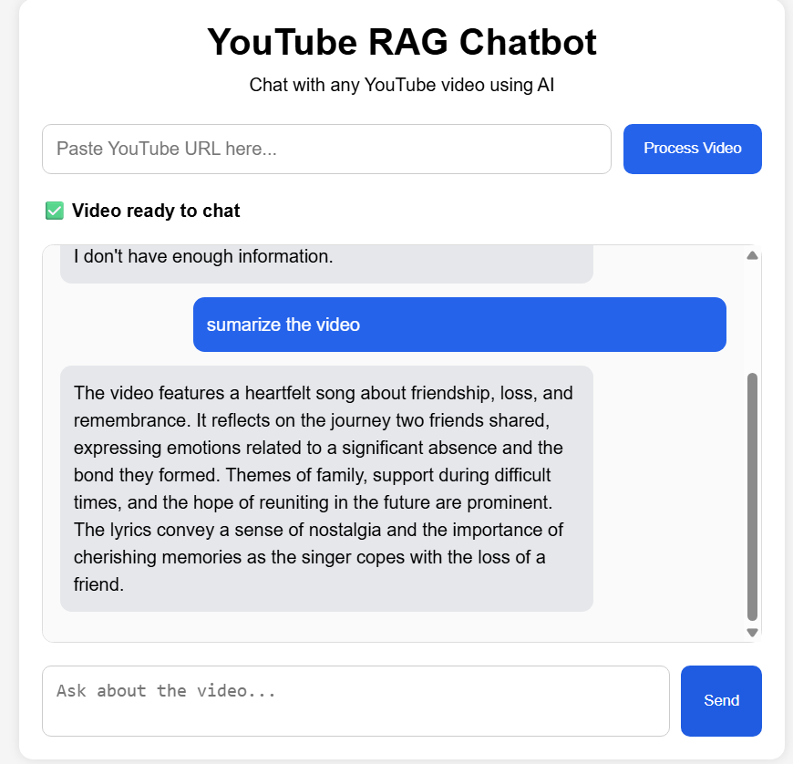

# YouTube RAG Chatbot

A Retrieval-Augmented Generation (RAG) chatbot built with FastAPI, LangChain, FAISS, and OpenAI embeddings.

This project allows users to:

* Paste a YouTube video URL
* Extract video transcripts
* Convert transcripts into embeddings
* Store embeddings in a FAISS vector database
* Ask questions about the video using semantic retrieval + LLM reasoning



---

# Features

* YouTube transcript extraction
* Transcript chunking using LangChain text splitters
* OpenAI embedding generation
* FAISS vector database storage
* Semantic search retrieval
* RAG-based question answering
* Video summarization
* FastAPI backend
* Interactive frontend chat UI
* Enter-to-send chat experience

---

# Tech Stack

## Backend

* Python
* FastAPI
* LangChain
* FAISS
* OpenAI Embeddings
* OpenRouter / GPT-4o-mini

## Frontend

* HTML
* CSS
* JavaScript

---

# Project Structure

```bash
app/
│
├── main.py
│
├── models/
│   └── model.py
│
├── routes/
│   ├── routes.py
│   └── url_loader.py
│
├── services/
│   ├── transcript_loader.py
│   ├── chunk_docs.py
│   ├── vector_store.py
│   ├── retriver.py
│   ├── chat_service.py
│   └── summary_service.py
│
├── static/
│   ├── style.css
│   └── script.js'
|   └── index.html
│
├── templates/
│   
│
└── data/
    └── faiss_index/
```

---

# How It Works

## 1. Process Video

User submits a YouTube URL.

```text
YouTube URL
↓
Transcript Extraction
↓
Chunking
↓
Embeddings
↓
FAISS Vector Store
```

---

## 2. Ask Questions

User asks a question about the video.

```text
User Question
↓
Retriever
↓
Relevant Chunks
↓
Prompt Template
↓
LLM
↓
Answer
```

# API Endpoints

## Process Video

```http
POST /process-video
```

### Request

```json
{
  "url": "https://www.youtube.com/watch?v=xxxx"
}
```

---

## Ask Question

```http
POST /ask
```

### Request

```json
{
  "question": "What is the video about?"
}
```

---

# Example Questions

* Summarize the video
* What does the speaker say about manipulation?
* What is the main topic?
* What advice does the speaker give?

---

# Future Improvements

* Conversation memory
* Streaming responses
* Multi-video sessions
* User authentication
* Chat history database
* Better transcript cleaning
* Hybrid search
* Re-ranking
* Docker deployment
* Cloud deployment

---

# Learning Concepts Used

This project demonstrates:

* RAG (Retrieval-Augmented Generation)
* Vector databases
* Embeddings
* Semantic search
* Prompt engineering
* LCEL chains
* FastAPI backend development
* Async frontend-backend communication
* AI application architecture

---

# License

This project is for educational and portfolio purposes.

---

# Author

Rakibul Haque Rabbi
